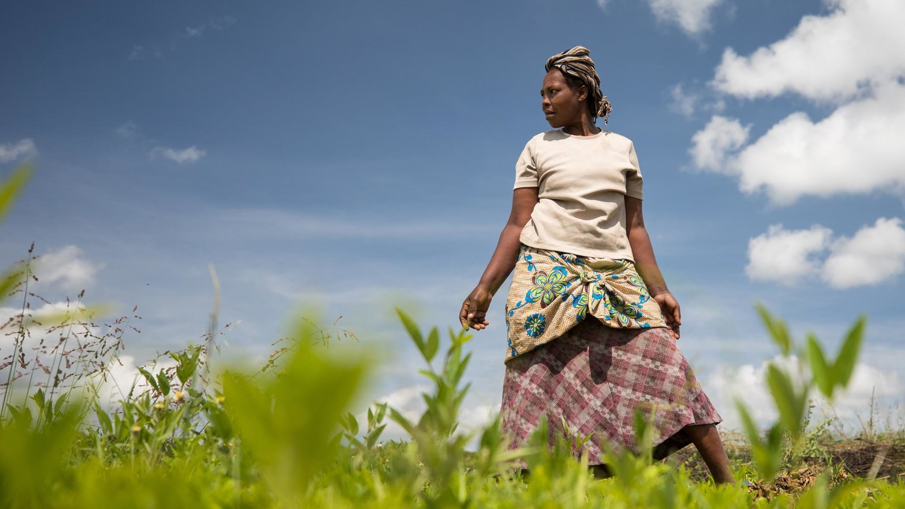

---
title: "Case Study 1: Explaining Loan Default in Microfinance"
---

```{r, echo=FALSE, include=FALSE}
library(kableExtra)
library(knitr)
library(tidyverse)
```



Microfinance is the provision of banking services to individuals excluded from traditional credit markets, typically due to a lack of collateral. The goal of microfinance is to enable low-income individuals to undertake small investments towards starting or improving a business in hopes. [Kiva](https://www.kiva.org/pgtmp/home) is a San Francisco based microfinance institution that connects online lenders to entrepreneurs in 77 countries following the peer-to-peer lending model. While Kiva operates as a nonprofit and aims to "expand financial access to help underserved communities thrive," default (nonrepayment of loans) threatens both the sustainability of Kiva's charitable enterprise and the stability of the lives Kiva aims to improve.

The Kiva 2012 database provides a collection of information on a random sample of loans provided from 2005-2012, which can be used to explore the factors influencing loan default.

# Learning Objectives

-   Gain proficiency linking records between multiple large data sets
-   Develop skills for the analysis of panel data
-   Learn methods for handling time to event data

# Case Study Goals

 - Quantify relationships between various sociodemographic and geographic factors and risk of default during the period 2005-2012
  - Quantify relationships between various sociodemographic and geographic factors and time to default (often censored) during the period 2005-2012
 - Help inform potential investors by estimating the probability of default


# Data

-   Data for this case study are available on the STA 440L container as well as on Sakai. Note: you may access the the active Kiva API if you would like to explore more recent data, however your analysis must address the 2005-2012 data provided
-   Additional data which provides regional or macroeconomic context may be included at your discretion; databases of potential interest are linked in the Resources section below

# Assignments and Report

-   Report and reproducible code (Group assignment due 1/24): produce a 8 page (maximum) report that clearly addresses the case study goals. This report should follow the format of a standard scientific report and should include sections for the introduction, methods, results, and discussion. The methods section should clearly identify the approach to model selection and evaluation, and the results section should clearly specify the final model selected, along with evidence the model provides a good fit to the data. Code should be fully reproducible. Code run time should be clearly specified at the head of the file.
- Peer review of reports will occur during the class on 1/24. During this class you will use the peer review rubric provided to provide constructive feedback on the other group's report you have been assigned.
- Revised report and response to reviews (Group assignment due 1/31): groups may submit revised reports and must submit a point-by-point response to the review comments provided.

# Resources

[Overview of Microfinance as an Economic Development Intervention](https://documents1.worldbank.org/curated/en/107171511360386561/pdf/WPS8252.pdf)

[The Peer-to-Peer Lending Model: How Kiva Works](https://www.kiva.org/about/how)

[In Depth Look at Default via a Case Study from Bangladesh](https://go.exlibris.link/wS3B81DF)

[World Bank Database Query Tool: Provides Data Including Development Indicators, Business Environment, Gender, Health, and Education Statistics](https://databank.worldbank.org/databases)

[International Economic and Financial Time Series from Federal Reserve Economic Data (FRED)](https://fred.stlouisfed.org/categories)


# Lecture Notes

[Introduction to Survival Analysis](../decks/survival.html)

[Accelerated Failure Time Models](../decks/survival_aft.html)

[Proportional Hazards Models](../decks/survival_cox.html)


