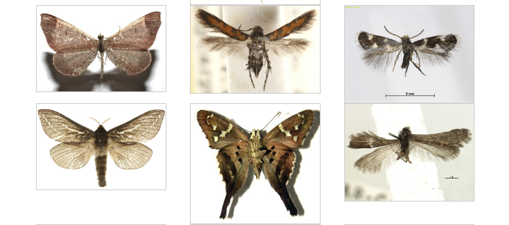

---
title: "Case Study 2: Classifying DNA Barcodes"
---

```{r, echo=FALSE, include=FALSE}
library(kableExtra)
library(knitr)
library(tidyverse)
```


 


DNA barcoding is the practice of classifying DNA sequences sampled from an environment
into a taxonomy, which is a nested sequence of tags spanned across 6 levels (phylum, class,
order, family, genus and species). As seen in the picture above, the process is
performed across various steps.

1. Collection of biologic material from the environment
2. DNA sequencing through PCR processing methods
3. Alignment of the obtained DNA. Alignment ensures that all the sequences are all of
the same length, and the locations are meaningfully comparable. 
4. Annotation. This means that we assign a taxonomic name to the sequence.

To show a concrete example, copy and paste the following DNA sequence into 
the Barcode of Life project (BOLD) identification engine [here](https://www.boldsystems.org/index.php/IDS_OpenIdEngine):

```R
---------------------------------------ACTTTATATTTTATTTTTGGAGTATGAGCAGGAATAATTGG
AACTTCTTTA---AGTTTAATAATTCGTACAGAATTAGGTAACCCTGGGTCACTAATTGGAGAT---GATCAAATTTATA
ATACTATTGTTACAGCTCATGCTTTTATTATAATTTTTTTTATAGTTATACCAATTATAATTGGAGGATTTGGTAATTGA
TTAATTCCCTTAATA---TTAGGAGCCCCTGATATAGCTTTCCCACGTATAAATAATATAAGATTTTGATTATTACCCCC
ATCATTAACTTTATTAATTTCTAGAAGTATTGTTGAAAATGGAGCAGGAACAGGATGAACAGTTTACCCCCCTCTTTCCT
CTAATATTGCCCATAGAGGATCTTCTGTTGATTTA---GCTATTTTTTCTCTACATCTTGCAGGAATTTCCTCCATCCTC
GGAGCAATTAACTTTATTACAACAATTATCAATATACGAATTAATAATATATCATTTGATCAAATACCTTTATTTGTATG
AGCAGTAGGAATTACTGCTTTATTATTATTATTATCATTACCGGTTTTAGCTGGT---GCAATTACTATATTATTAACTG
ATCGAAATTTAAATACCTCTTTTTTTGACCCTGCTGGCGGAGGAGACCCAATTCTTTACCAACATTTA------------
--------------------------------------------------------------------------------
--------------------------------------------------------------------------------
---------------------
```

The taxonomy of the DNA sequence should be returned (tap the [Species page button](https://www.boldsystems.org/index.php/Taxbrowser_Taxonpage?taxid=70536)).
Which species is identified by the DNA sequence? With which level of confidence?


In this case study, a researcher from a Finnish lab has given you 7000 aligned
DNA sequences collected by capturing butterflies (technically, all specimens belong
to the order of *Lepidoptera*) in a nearby forest. Even though they he can
confidently place the DNA sequences into the order of Lepidoptera, they would
like to know more about the taxonomy of the specimen collected, since this was
not possible to recognize through morphology. To fulfill this task, you are also
given a historical dataset of 40000 annotated DNA sequences for which annotations
have been confidently established. Your job is to build a classification model using
this dataset and then to annotate the 7000 DNA sequence at the *family* and at the *genus* levels.
In doing this, it is important that you introduce a measure of how uncertain your
final annotation is. 

**EXTRA POINTS - ** Most of the time, taxonomic classification has an issue: 
the DNA sequence might be from a new specimen that is from a family or a genus 
that is not observed in the training set. How would take care of such a situation?
Can you modify your model to account for *new* families or new genuses?
How does that change your answer?


# Learning Objectives

-   Learning about classification methods, such as logistic regression, multinomial
    regression, Naive Bayes and (if time allows) more complex ML methods. 
-   Learning how to evaluate a classification model (accuracy, ROC curves, MCC)
-   Develop skills to handle categorical predictors
-   Learning how to summarize and play with DNA-type data


# Case Study Goals
 
For each test DNA sequence, predict the Family and the Genus and provide a measure
for the confidence in your prediction (e.g. best probability). When you build your model,
make sure to first validate on a validation set (eg. 30%) of your training data. 


Make sure you address the following questions (variable selection methods can be used):

  - How accurate are your in-sample predictions at the family and at the genus levels?
  
  - What about in the validation set(s)?
  
  - Is the whole DNA sequence important for doing classification? 
  
  - Which loci along the sequences are particularly important for classification?

# Data

Data for this case study are available on the STA 440L container as well as on Sakai.
There are two datasets:

 - *Lepidoptera_library.csv*: a dataset of 40000 DNA sequences and their annotations. You can ignore the species column, since we are interested in only family and genus
 
 - *test_sequences.csv*: 7000 test DNA sequences. No affiliation is reported, so your job is
 to predict both family and genus, and also to verify if some DNA sequences correspond to "new" species (if you want extra points).

The DNA sequence is constructed so that loci are comparable. However, alignnment comes
with some problems. For example, some loci will not have the classic *A*, *C*, *G* and *T*
letters, but might have alignemnt gaps *-* or other [special characters](https://en.wikipedia.org/wiki/Nucleic_acid_notation). It is up to you 
how to deal with these terms, as long as you justify yorur choice. 


# Assignments and Reports: UPDATE

-   Report and reproducible code (Group assignment due February 28): produce a 8 page (maximum) report that clearly addresses the case study goals. The first page of the report should include the team number and names of all team members. This report should follow the format of a standard scientific report and should include sections for the introduction, methods, results, and discussion. The methods section should clearly identify the approach to model selection and evaluation, and the results section should clearly specify the final model selected, along with evidence the model provides a good fit to the data. Code should be fully reproducible. Code run time should be clearly specified at the head of the file.
- Peer review of reports will occur during the class on February 21. During this class you will use the peer review rubric provided to provide constructive feedback on the other group's report you have been assigned.
- Revised report and response to reviews (Group assignment due February 28): groups may submit revised reports and must submit a point-by-point response to the review comments provided.

# Submission guidlines

Submit a dataset of the prediction in Github, following the format available in the 
template file, in addition to code and your reproducible report. 

# Resources

[Overview of taxonomy and taxonomic classification](https://geo.libretexts.org/Courses/University_of_California_Davis/GEL_098-16%3A_Geobiology_(Sumner)/Text/4%3A_Tracing_the_History_of_Evolution/4.3%3A_The_Levels_of_Classification)


[Video: end-to-end DNA barcoding procedure](https://www.youtube.com/watch?v=zcd3QYngHX0&ab_channel=iBOLConsortium)

[PNAS commentary on DNA barcoding](https://www.pnas.org/doi/10.1073/pnas.0800476105#:~:text=DNA%20barcoding%20aims%20to%20use,1)

[Barcode of Life project](https://www.boldsystems.org/)

[Multinomial regression via glmnet](https://glmnet.stanford.edu/articles/glmnet.html)

# Lecture Notes

[Introduction to logistic and multinomial regression](../decks/logistic_and_multinomial.html)

[Naive Bayes Classifiers](../decks/Naive_Bayes.html)

[Variable Selection and the Lasso](../decks/lass.ohtml)


