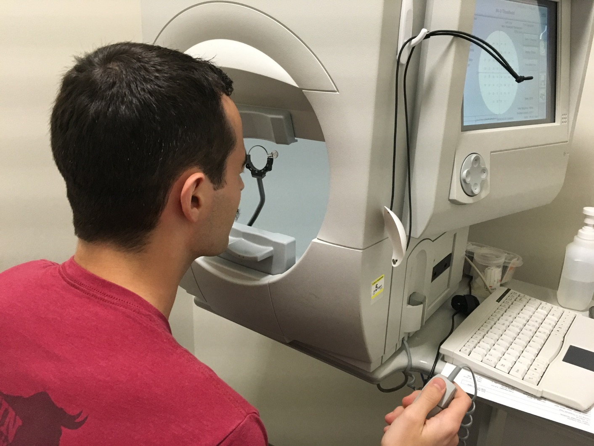
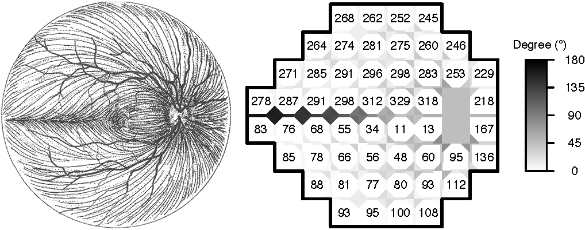

```{r, echo=FALSE, include=FALSE}
library(kableExtra)
library(knitr)
library(tidyverse)
```

------------------------------------------------------------------------

{width="35%"}
{width="55%"}

Glaucoma is the leading cause of irreversible blindness world wide with over 60 million glaucoma patients as of 2012. Since impairment caused by glaucoma is irreversible, early detection of disease progression is crucial for effective treatment. To monitor glaucoma status, patients are routinely administered visual field examinations; a functional assessment of a patient's vision that yields a map across the field of vision. Glaucoma clinicians are then tasked with determining rates of disease progression from these longitudinal series of visual fields. This data contains complex spatial and temporal dependencies that must be accounted for when determining progression. Bryan et al (2013) provide a database that can be used to test if there are advantages to using a model that explicitly specifies spatial structure. 

# Learning Objectives

- Fit a spatial model to complex spatiotemporal data
- Gain proficiency handling datasets that have both longitudinal and spatial structure
- Learn the difference between labeled and unlabeled longitudinal data
- Translate an important clinical question into a valid research question 
- Interpret model results in clear language accessible to general readers

# Case Study Goals

- Develop a statistical model that can be used to predict a future visual field for a patient given an existing longitudinal series of visual fields for that patient.
- Determine whether using a spatial model that accounts for the neighborhood dependencies of the visual field improves the prediction performance.
- Quantify the heterogeneity in prediction performance across regions of the visual field. 

# Data

- Data from this study are available on the Rotterdam Ophthalmic Data Repository. The data set is called "Longitudinal Glaucomatous Visual Field data" and can be accessed here: [Rotterdam Opthalmic Data Repository](http://www.rodrep.com/longitudinal-glaucomatous-vf-data---description.html "Rotterdam Opthalmic Data Repository")

# Assignments and Reports

- Report and reproducible code (Group assignment due 3/24): produce a 8 page (maximum) report that clearly addresses the case study goals. This report should follow the format of a standard scientific report and should include sections for the introduction, methods, results, and discussion. The introduction section should clearly motivate the need for this research, define a research question and state a hypothesis. The methods section should clearly identify the models, including a description of (1) a spatial model, and (2) a non-spatial model; the definition of heterogeneity across the regions of the visual field; and also define the performance evaluation measures. The results section should clearly demonstrate a comparison between the models. The discussion section should discuss the results within the context of the research question and hypothesis. Code should be fully reproducible. Code run time should be clearly specified at the head of the file.
- Reproducibility criteria: provide an .R file that reviewers will check for reproducibility. The file should include the following values stated at the top of the file: (1) prediction performance of the spatial model; and (2) prediction performance of the non-spatial model. Please ensure your .R file is well-documented with comments that point out where this code appears, and where the output is printed.
- Peer review of reports will occur during the class on 3/24. During this class you will use the peer review rubric provided to provide constructive feedback on the other group's report you have been assigned.
- Revised report and response to reviews (Group assignment due 3/31): groups may submit revised reports and must submit a point-by-point response to the review comments provided.

# Resources

- [Bryan et al 2013. Robust and Censored Modeling and Prediction of Progression in Glaucomatous Visual Fields](https://doi.org/10.1167/iovs.12-11185 "Robust and Censored Modeling and Prediction of Progression in Glaucomatous Visual Fields")
- [Statistics in Glaucoma: Part I](https://rviews.rstudio.com/2018/12/03/statistics-in-glaucoma-part-i/ "Statistics in Glaucoma: Part I")
- [Statistics in Glaucoma: Part II](https://rviews.rstudio.com/2018/12/07/statistics-in-glaucoma-part-ii/ "Statistics in Glaucoma: Part II")
- [Statistics in Glaucoma: Part III](https://rviews.rstudio.com/2018/12/18/statistics-in-glaucoma-part-iii/ "Statistics in Glaucoma: Part III")
- R packages relevant to working with visual field data: [womblR](https://cran.r-project.org/web/packages/womblR/vignettes/womblR-example.html "womblR"), [spCP](https://cran.r-project.org/web/packages/spCP/vignettes/spCP-example.html "spCP"), [spBFA](https://cran.r-project.org/web/packages/spBFA/vignettes/spBFA-example.html "spBFA")
- R packages relevant to working with areal spatial data: [CARBayes](https://cran.r-project.org/web/packages/CARBayes/vignettes/CARBayes.pdf "CARBayes"), [CARBayesST](https://cran.r-project.org/web/packages/CARBayesST/vignettes/CARBayesST.pdf "CARBayesST")

# Lectures

[Introduction to Case Study 3](../decks/CaseStudy3Intro.pdf)

[Areal Spatial Statistics](../decks/ArealData.pdf)

[Point-referenced Spatial Statistics]

[Additional Topics in Spatial Statistics]


