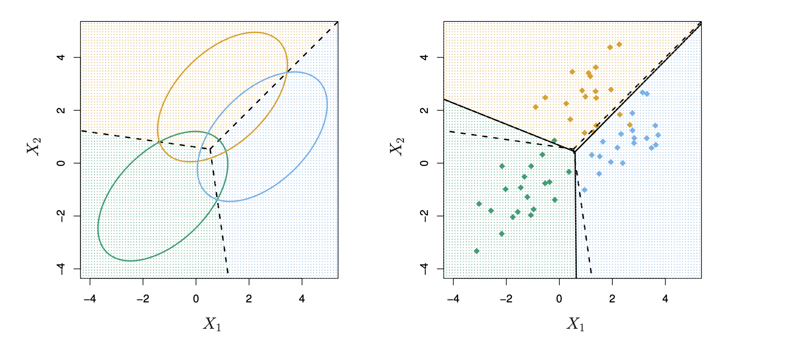

```{r child = "../setup.Rmd"}
```


### Introduction to LDA: Bayes rule
Multi-class classification methods such as the multinomial logistic regression sometimes
may fail when the classes are well separated according to the data. This is mostly due to the $\beta$ coefficients in the  likelihood. 

A famous alternative when we have multiple classes is to rely on what is known as **Linear discriminant analysis** (LDA) and its extensions like quadratic discriminant analysis (QDA). The algorithm is a generalization of Fisher's linear discriminant. 

LDA relies on Bayes rule. Suppose that we have $y \in\{1, \ldots, K\}$ classes and each observation has a covariate vector  $\mathbf{x} \in\mathbb{R}^p$. From Bayes rule, we have that

$$\mathbb{P}(y = k \mid \mathbf{x}) = \frac{\pi_k \times p(\mathbf{x} \mid y = k) }{\sum_{j = 1}^K \pi_j \times p(\mathbf{x} \mid y = j)}, \quad \pi_k = \mathbb{P}(y = k),$$

where $\pi_k$ is a prior probability of class $k$ and $p(\mathbf{x} \mid y = k)$ is the 
likelihood that models the covariates conditional on the class. Usually,  $\pi_k = n_k/n$, where $n_k$ is the number of observations within class $k$ in the training set.

We then predict the class that has the highest posterior probability, usually ignoring 
the denominator and expressing everything in log term:

$$
\hat{y} = \arg\max_{k \in \{1, \ldots, K\}} \log \pi_k + \log{p(\mathbf{x} \mid y = k)} 
$$

---
### Linear, quadratic and regularized discriminant analysis 

Discriminant analysis seeks for a  **partition the input space** that provides the 
best separation among the labels, and assigns to each region the most likely label. 

The method arises when we have **multivariate continuous data**. In this case, the 
likelihood component is modelled as a **multivariate normal**:

$$p(\mathbf{x} \mid y = k) = \frac{1}{(2\pi)^{p/2}|\boldsymbol{\Omega}|^{1/2}} \exp\left\{ -\frac{1}{2} (\mathbf{x}  - \boldsymbol{\mu}_k)^\top\boldsymbol{\Omega}^{-1}(\mathbf{x}  - \boldsymbol{\mu}_k)\right\}$$

where $\boldsymbol{\mu}_k$ is the mean vector of class $k$ and $\boldsymbol{\Omega}$ is 
a variance/covariance matrix. In particular

- If $\boldsymbol{\Omega} = \boldsymbol{\Sigma}$, where $\boldsymbol{\Sigma}$ is the *global*
variance-covariance matrix, we have **LDA**
- If $\boldsymbol{\Omega} = \boldsymbol{\Sigma}_k$ where $\boldsymbol{\Sigma}_k$ is the *class-specific* variance-covariance matrix, we have quadratic discriminant analysis or **QDA**
- If $\boldsymbol{\Omega} = \alpha\boldsymbol{\Sigma}_k + (1-\alpha)\boldsymbol{\Sigma}$ we have **regularized** discriminant analysis, and the parameter $\alpha$ is tuned via cross-validation.

Estimation of the parameters is straightforward!

- Mean: $\hat{\boldsymbol{\mu}}_k = \frac{1}{n_k}\sum_{i: y_i = k} \mathbf{x}_i$
- Global variance-covariance matrix: $\boldsymbol{\Sigma} = \frac{1}{N-K}\sum_{k = 1}^K\sum_{i: y_i = k} (\mathbf{x}  - \hat{\boldsymbol{\mu}}_k)(\mathbf{x}  - \hat{\boldsymbol{\mu}}_k)^\top$

and similarly for $\boldsymbol{\Sigma}_k$. 
---
### LDA in practice: package `MASS`

LDA established decision boundaries in the plot. For derivations, see Chapter 4.3 in 
The Elements of Statistical Learning. 
```{r, echo=FALSE, out.width="50%"}

```

We run it via the package  `MASS` using the usual `iris` dataset. 

```{r, include = FALSE}
library(tidyverse)
data("iris")
```

```{R} 
# Split the iris data between training and test
set.seed(10); test_id <- sample(1:nrow(iris), size = round(.4*nrow(iris)))
data_train <- iris[-test_id, ]
data_test <- iris[test_id, ]

# Run LDA and QDA
library(MASS)
linear <- MASS::lda(Species ~ .,data = data_train)
quadratic <- MASS::qda(Species ~ .,data = data_train)
```
---
### In- and out-of-sample predictions
```{r}
# In sample
linear_pred <- predict(linear)$class  # This is the class, but you can also retrieve posterior probabilities
quadratic_pred <- predict(quadratic)$class
# out of sample
linear_pred_test <- predict(linear, newdata = data_test)$class
quadratic_pred_test <- predict(quadratic, newdata = data_test)$class

# Accuracies
tab <- cbind(c("LDA", "QDA"),
      round(c(mean(linear_pred == data_train$Species),
        mean(quadratic_pred == data_train$Species)), 3),
      round(c(mean(linear_pred_test == data_test$Species),
        mean(quadratic_pred_test == data_test$Species)),3))
colnames(tab) <- c("method", "Training", "Test")
tab
```

In such a small dataset, there is very little difference in the prediction.

---
### Naive Bayes

Naive Bayes is similar to LDA, bu can apply also when we have categorical features.
We assume that the likelihood is a product of independent univariate kernels. We treat covariates as independent. We can write this as

$$
 p(\mathbf{x} \mid y = k) = \prod_{j = 1}^p p(x_i \mid y = k).
$$
The advantage of this approach is that we can be really flexible. For example, the 
individual kernels can be univariate normals (this is the case when $\boldsymbol{\Omega} = \text{diag}\{\sigma^2_1, \ldots, \sigma^2_p\}$). Alternatively, suppose that we have
categorical predictors like

$$x_j \in \{ 1,2,3,4\}, \quad j = 1, \ldots, p.$$

Then, we could model the kernel as a multinomial:
$$p(\mathbf{x} \mid y = k) = \prod_{j = 1}^p \prod_{g = 1}^4\theta_{j,g}^{1(x_j = g)}$$
where $\theta_{j, g}$ is the probability of detecting category $g$ for variable $j$. Estimation is simple: just calculate the proportion of each category 1,2,3,4 for each variable and for each class (maybe adding Laplace smoothing to avoid zero counts). **Can this be of any use for the case study? :)** For examples of kernels, see this [Python reference](https://scikit-learn.org/stable/modules/naive_bayes.html)
---
### Naive Bayes in practice

We use Naive Bayes via `library(e1071)`.

```{r}
library(e1071)
# Naive Bayes with normal continuous predictors
nBayes <- naiveBayes(Species ~ ., data = data_train)
nBayes$tables$Sepal.Length  # Mean and variance for the normal distribution of covariate 1

# Predict!
tab <- rbind(tab, c("Naive Bayes",
      round(mean(predict(nBayes, newdata = data_train) == data_train$Species), 3), 
      round(mean(predict(nBayes, newdata = data_test) == data_test$Species), 3)))
tab
```


---

### Next steps

Prediction in the last case does not work as well as the LDA, becuase Naive bayes is 
a simpler model

However, under a lot of predictors, Naive Bayes can be very helpful!

Also, we can use it with categorical covariates very simply. This is automatic in the package `library(e1071)`.

Next lecture, shrinkage method and the LASSO!


