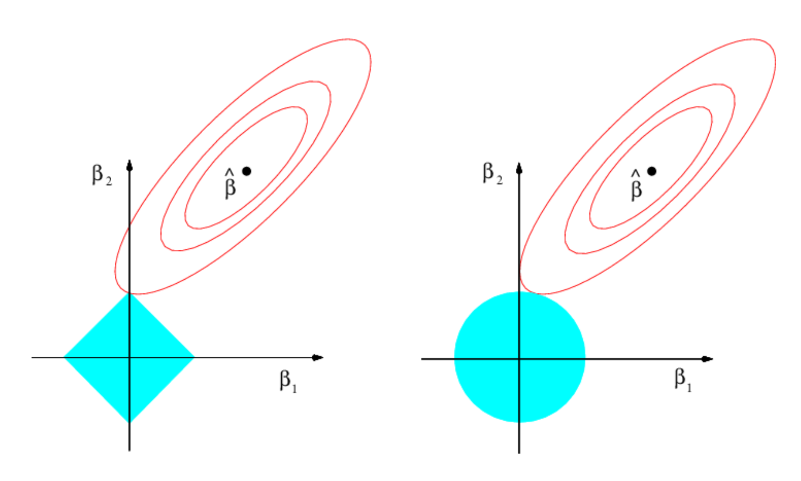

```{r child = "../setup.Rmd"}
```

```{r, include=FALSE}
library(tidyverse)
```


### Fitting linear models

Linear regression is an amazing tool for inference and prediction. However, the simplest
linear model may suffer when the number of predictors increases a lot. This is 
because there is not a unique way to **exclude** certain covariates.

Recall that the linear model optimization problem is the following: given a set of covariates
$\mathbf{X} \in \mathbb{R}^p$ and a dependent variable $\mathbf{y} \in \mathbb{R}$, we want to find
the linear combination of the covariates that minimizes the sum of square residuals:

$$\hat{\boldsymbol{\beta}} = \arg \min_{\beta} \ (\mathbf{y} - \mathbf{X}\boldsymbol{\beta})^\top(\mathbf{y} - \mathbf{X}\boldsymbol{\beta}),$$

and the solution is the classic OLS estimator $\hat{\boldsymbol{\beta}} = (\mathbf{X}^\top  \mathbf{X})^{-1}\mathbf{X}^\top \mathbf{y}$.

If we want to exclude some covariates, we have the classic **subset selection methods**:
find the best set of predictors among all possible alternatives. If we want to include for example
only $k$ predictors, the total number of models we need to evaluate (either in terms of lowest
residual sum of squares or highers $R^2$ is $p!/[k!(p-k)!]$). Too much, if we consider all possible $k$.

Alternatives that do not consider all the possibilities are 

- Forward stepwise selection: start from a null model, add recursively one predictor and then pick the best model with cross validation.
- Backward stepwise selection: start from the full model, and then recursively exclude predictors.


---
### Alternative: shrinkage!

A convenient alternative instead is provided by **ridge** and **lasso** regression, that is, we want to control for both the bias and the variance of the estimation procedure.
Both methods return **shrinkage** estimators: the resulting optimal coefficients 
are pulled towards zero. In particular, ridge regression solves the following minimization problem

$$\hat{\boldsymbol{\beta}} = \arg \min_{\beta} \ (\mathbf{y} - \mathbf{X}\boldsymbol{\beta})^\top(\mathbf{y} - \mathbf{X}\boldsymbol{\beta}) + \lambda||\boldsymbol{\beta}||_2^2,$$

where $||\boldsymbol{\beta}||_2^2 = \sum_{j=1}^p \beta_j^2.$ Here, $\lambda$ is a 
shrinkage parameter that we tune via *cross-validation*. In particular, $\lambda$ incorporates a 
**penalty** in our model: if the size of the coefficients is too high, then we will have a 
greater penalty.

The solution for ridge is famously available in closed form, and is

$$
\hat{\boldsymbol{\beta}}_{ridge} = (\mathbf{X}^\top  \mathbf{X} + \lambda \mathbf{I}_p)^{-1}\mathbf{X}^\top \mathbf{y}
$$
Two important notes:

- Ridge coefficient are pulled to 0, but are never set equal to zero under
a reasonable penalty (*soft penalty*): **no variable selection!**
- While OLS estimates are scale equivariant (eg. multiplying predictors by a constant
leads to a scaling of the estimates by the inverse of such a constant). Instead, **ridge regression is not
equivariant**. We need to standardize the predictors before regression.


---
### Lasso regression

If we want to incorporate a *hard penalty* and do variable selection, instead, we rely on *lasso*.  

$$\hat{\boldsymbol{\beta}} = \arg \min_{\beta} \ (\mathbf{y} - \mathbf{X}\boldsymbol{\beta})^\top(\mathbf{y} - \mathbf{X}\boldsymbol{\beta}) + \lambda||\boldsymbol{\beta}||_1^2,$$
where $||\boldsymbol{\beta}||_1^2 = \sum_{j=1}^p |\beta_j|.$ The absolute value
forces excessively high coefficients to be put to 0. 

Unfortunately, the lasso solution is not available in closed form. Ro solve it, we rely on 
various algorithms such as the LARS (Lasso-modified least angle regression) or
a pariwise coordinate optimization, optimizing successively over each $\beta_j$.

We do not cover the algorithms here. Refer to Chapters 3.4.4 and 3.8.6 of THe Elements 
of Statistical Learning if you are interested. 


What if we want to include both shrinkage and variable selection? **Elastic net!**

$$\hat{\boldsymbol{\beta}} = \arg \min_{\beta} \ (\mathbf{y} - \mathbf{X}\boldsymbol{\beta})^\top(\mathbf{y} - \mathbf{X}\boldsymbol{\beta}) + \lambda[\alpha||\boldsymbol{\beta}||_2^2 +  (1-\alpha)||\boldsymbol{\beta}||_1],$$

and $\alpha \in [0, 1]$ is another tuning parameter.
---
### Ridge and Lasso in pictures

Ridge and Lasso have a famous dual optimization problem. For example, in the Lasso case we have
$$
\arg\min_\beta (\mathbf{y} - \mathbf{X}\boldsymbol{\beta})^\top(\mathbf{y} - \mathbf{X}\boldsymbol{\beta})  \quad \text{sub} \quad ||\boldsymbol{\beta}||_1\leq \tau.
$$
In other words, the $\lambda$ coefficient is just the Lagrange multiplier for this 
optimization problem: for every $\lambda$ there exists a $\tau$ and vice-versa, so the two problems are equivalent. 

```{r, echo=FALSE, out.width="50%"}

```

---
### Lasso and Ridge for logistic regression

For logistic regression, the idea is basically the same as the standard linear regression case,
with the caveat that a solution is not availble in closed form. 

Letting $y_i  \in \{0, 1\}$, we optimize the following:

$$\arg \min_{(\beta_0, \boldsymbol{\beta})} = - \left\{\sum_{i = 1}^n y_i(\beta_0 + \mathbf{x}_i^\top \boldsymbol{\beta}) + \log(1 + e^{\beta_0 + \mathbf{x}_i^\top \boldsymbol{\beta}}) \right\} + \lambda||\boldsymbol{\beta}||_1.$$

The shrinkage and the variable selection properties remain the same!

Again, we tune $\lambda$ via cross-validation. For example, 10fold is good way of doing it. 

All of these methods are applied via the package `glmnet`. By default, the package 
runs lasso for a grid of 100 values for $\lambda$. The ridge penalty is specified by letting the parameter $\alpha = 0$. If this is set between 0 and 1, we have the elastic net penalty. 


---
### Lasso and Ridge in practice via `glmnet`

```{r}
# Load the package to perform ridge and lasso
library(glmnet)
# Load the dataset 
data("iris")
# Let's add noise covariates and see if the model is able to exclude them
y <- as.factor(iris$Species)
x <- iris[, 1:4]
X <- cbind(x, matrix(rnorm(nrow(x)*8), ncol= 8))

# Run glmnet (via the default cross validation methods)
fit <- cv.glmnet(x = as.matrix(X), y = y, nfolds = 10, family = "multinomial")
```
---
### Cross validation and the lasso
Recall that the multinomial deviance is specified as $-2\sum_{i=1}^n\log \hat{\pi}_{i_j}$,
where $\hat{\pi}_{i_j}$ is the predicted probability of class $j$ for observation $i$.


```{r}
# Check the multinomial deviance for the model to select the best lamda
plot(fit)
```
---
### Predict with glmnet

```{r}
# Do prediction with the best lambda
pred <- predict(fit,newx = as.matrix(X), s = "lambda.min", type="class")
table(pred, y)
```


Let's look at the coefficients for the best $\lambda$. 
```{r}
# Re-estimate the model with the best lambda. This in not necessary, since this model
# is already present in fit
fit_best <- glmnet(x = as.matrix(X), y = y, family = "multinomial", lambda = fit$lambda.min)
fit_best$beta
```


