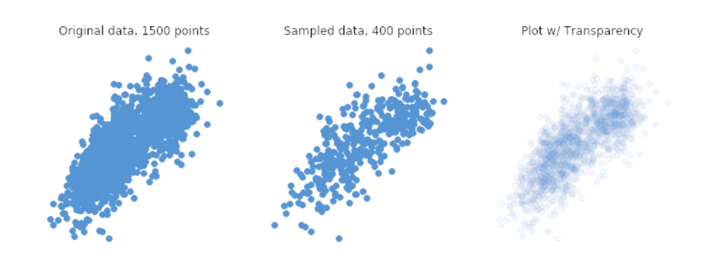
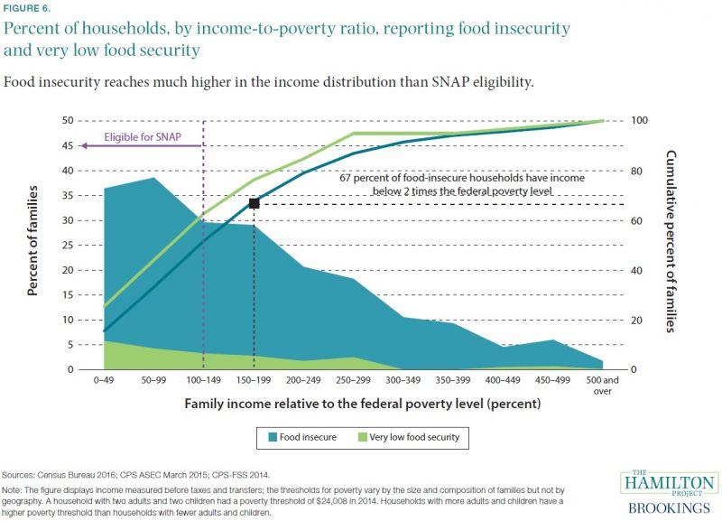

```{r, include=FALSE}
library(tidyverse)
library(kableExtra)
```


### Myth 1: Predictor Correlation is a Necessary Condition for Interaction

*Statistical interaction* does **not** require predictors to be correlated with each other.  Interaction is present when the **association** between a predictor $x$ and outcome $y$ depends on the level of a third factor, $z$. 

---

### Example: Weight Training Study 

To start the study, participants (a random sample of stats majors) use a weight machine to measure the maximum weight they can lift in a bicep curl. Suppose these weights $x$ range from 5 to 80 pounds in the sample.

After they complete the test, a coin flip is used to randomize participants to receive Treatment A ($z=1$) or Treatment B ($z=0$).

Participants on Treatment A take in a weight training class twice weekly in which they complete 3 sets of 10 reps of bicep curls using 5-20 pounds (maximum). Participants on Treatment B participate in a walking program twice weekly in which they walk the 2.9 mile Al Buehler trail. (Participants are not restricted with respect to their prior activities; these treatments are in addition to anything they were doing for fitness before.) After four weeks, the strength test is repeated, and results are recorded in variable $y$.

---

### Correlation

Are $x$ and $z$ correlated?  Explain why or why not.

---

### Myth 2: Predictors Need to be Normally Distributed

Does $x$ have to be normal?  Is $z$ normal?  

Is this a problem? Does linear regression assume a distribution on $x$ or $z$?

---

### Back to Example: Pre-post Model on Treatment B (Walking)

Consider the simple model $$y_i=\beta_0+\beta_1 x_i + \varepsilon_i, ~~~ \varepsilon_i \sim N(0,\sigma^2), ~~ i=1,\ldots,n_B$$  

- Suppose $\beta_0=\sigma^2=0$ and $\beta_1=1$. What does this mean, and is this realistic?

- Suppose $\beta_0=0$, $\beta_1=1$, and $\sigma=2$. Is this more realistic? Why or why not?

---

### Back to Example: Pre-post Model on Treatment A (Lifting 10-30 Pounds)

Consider the simple model $$y_i=\beta_0+\beta_1 x_i + \varepsilon_i, ~~~ \varepsilon_i \sim N(0,\sigma^2), ~~ i=1,\ldots,n_A$$  

- Suppose $\beta_0=\sigma^2=0$ and $\beta_1=1$. What does this mean, and is this realistic?

- If $\beta_0 \neq 0$, is $\beta_0>0$ or $\beta_0<0$ more likely?  Why?

- What values for $\beta_1$ and $\sigma$ may be reasonable?

---

### Back to Example: Combining the Groups in One Model

If we want to evaluate a treatment effect, we need to combine the groups into one model!  Let's say we use the model $$y_i=\beta_0+\beta_1 x_i + \beta_2 z_i + \beta_3 x_i z_i + \varepsilon_i, ~~~ \varepsilon_i \sim N(0,\sigma^2), ~~ i=1,\ldots,n.$$

1. What does $\beta_3=0$ mean in terms of the $\beta_1$ values from the two previous models?

2. What does $\beta_2=0$ mean in terms of the $\beta_0$ values from the two previous models?

3. What values of $(\beta_0, \beta_1, \beta_2, \beta_3)$ seem realistic?

---

### Myth 3: Aesthetics are Irrelevant (meet $\alpha$)

```{r, echo=FALSE, out.width="100%"}

```
Graphic from chartio.com

---

### Myth 4: Table Format Doesn't Matter

```{r, warning=FALSE, message=FALSE}
library(tidymodels)
data(Chicago)

Chicago <- Chicago %>% select(ridership, Clark_Lake, Austin, Harlem)
lm_spec <- linear_reg()

lm_fit <- fit(lm_spec, ridership ~ ., data=Chicago)

tidy(lm_fit)
```

---

```{r}

# now suppose we want 95% CI

lm_table <- lm_fit %>%
  tidy() %>%
  mutate(lower_ci = round(estimate - 1.96*std.error, 3),
         upper_ci = round(estimate + 1.96*std.error, 3)) %>%
  mutate(conf.int.95 = paste0("(", lower_ci, ", ", upper_ci, ")")) %>%
  dplyr::select(-c(lower_ci, upper_ci, statistic, p.value))

lm_table

```

---

```{r }

#Now we want to get rid of the annoying jargon Clark_Lake

lm_table %>%
  mutate(term=c("Intercept","Clark Lake","Austin","Harlem")) %>%
  kbl(digits=2, caption = "Linear Regresssion Estimates", 
      col.names=c("Variable","Estimate","SE","95% CI")) %>%
  row_spec(0,bold=TRUE) %>%
  kable_styling()

```

---

### Myth 5: Scaling Doesn't Matter!

```{r}
x=runif(1000,10000000,1000000000) #10 mil to 1 bil
err=rnorm(1000,0,100)
y=0.0000001*x+err
tidy(lm(y~x)) %>%
  kbl(digits=2) %>%
  kable_styling()


```

How do you interpret the estimate of $\beta$ corresponding to the predictor $x$?

---

```{r}
x2=x/1000000000 #convert to billions
tidy(lm(y~x2)) %>%
  kbl(digits=2) %>%
  kable_styling()


```

Note how the test statistic is unaffected, but the estimate can now be interpreted!

---

### Myth 6: All Predictors Act Linearly


```{r, echo=FALSE, out.width="70%"}

```

Is the association between a 100 percentage point increase in percent of poverty line and food security the same across the scale of percent of poverty (x-axis)?

---

### Back to Example: Pre-post Model on Treatment A (Lifting 10-30 Pounds)

Consider model (1) $$y_i=\beta_0+\beta_1 x_i + \varepsilon_i, ~~~ \varepsilon_i \sim N(0,\sigma^2), ~~ i=1,\ldots,n_A$$  and linear spline model (2) $$y_i=\beta_0+\beta_1 x_i + \beta_2 (x_i-15)_+ + \beta_3 (x_i-30)_+ + \varepsilon_i, ~~~ \varepsilon_i \sim N(0,\sigma^2), ~~ i=1,\ldots,n_A$$

Note we can use a higher-order spline to avoid discontinuities at the knots.  What might we expect the values of $(\beta_0, \beta_1, \beta_2, \beta_3)$ to be?

