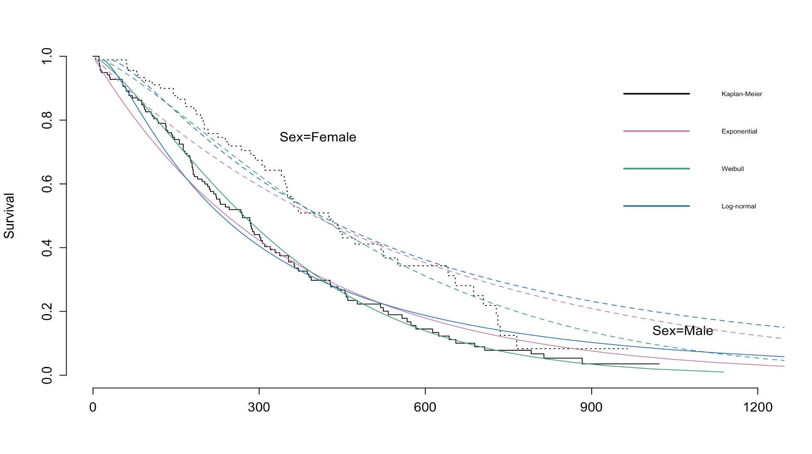

## Accelerated failure time model

An *accelerated failure time* (AFT) model assumes

\begin{align*}
\log(T_i) = \beta_0 + \beta_1x_1 + \beta_2x_2 + \cdots + \beta_px_p + \epsilon_i
\end{align*}

where $\epsilon_i$ are commonly assumed to be iid and follow some specified
distribution.

There is a one-to-one relationship between the distribution of $T$ and the
assumed error distribution in the AFT model.

For instance, if $\epsilon$ has a normal distribution, then $T$ has a log-normal 
distribution. If $\epsilon$ has a gen. EV distribution, then $T$
has a Weibull distribution, etc. 

In software packages, these models are often fit by specifying the distribution
of $T$.

## Accelerated failure time model

Note that we can also write the AFT model as

\begin{align*}
T_i &= \exp\left(\beta_0 + \beta_1x_{1i} + \beta_2x_{2i} + \cdots + \beta_px_{pi} \right)e^{\epsilon_i}\\
&= e^{\beta_0}e^{\beta_1x_{1i}}e^{\beta_2x_{2i}}\cdots e^{\beta_px_{pi}}e^{\epsilon_i}
\end{align*}

Covariates in an AFT model have a multiplicative effect on *time*. For instance,
if $\beta_k = 0.4$, then $\exp(\beta_k) \approx 1.5$. Holding all else equal,
an individual with covariate $x_k$ one unit greater than another is expected
to survive approximately 1.5 times longer than the other.

Think of holding a rubber band representing time.  For $\beta_k > 0$, you are stretching the band (longer time), and for $\beta_k < 0$, it is retracting.

## Lung cancer data

We consider the **lung** dataset from the `survival` R package.  It includes data from patients with advanced lung cancer in the North Central Cancer treatment group.  For simplicity, we consider the outcome `time` (survival time in days), censoring indicator `status` (1=censored, 2=dead), and binary `sex` (1=male, 2=female). (There are strong differences by sex in lung cancer, both in cancer type and in prognosis.)

## Data processing

```{r dataprocess, warning=F, message=F}
library(tidyverse)
library(survival)

lung2 <- lung %>%
  mutate(Sex = case_when(
    sex == 1 ~ "Male",
    TRUE ~ "Female")) %>% # works because no missing values in sex
  mutate(Sex = fct_relevel(Sex, "Male")) 

lung2$SurvObj <- with(lung2, Surv(time,status)) #default assumes 1=censored, 2=dead, which is the case here, or 0=alive, 1=dead, need to watch if other coding scheme used

```

## Exponential AFT model

```{r expaft, message=F, warning=F}

aft_e <- survreg(SurvObj~Sex, data=lung2, dist="exponential")
summary(aft_e)
```

## Weibull AFT model
```{r weibaft, message=F, warning=F}
aft_w <- survreg(Surv(time,status)~Sex, data=lung2, dist="weibull")
summary(aft_w)
```

## Log-normal AFT model
```{r lognorm, message=F, warning=F}
aft_ln <- survreg(Surv(time,status)~Sex, data=lung2, dist="lognormal")
summary(aft_ln)

```

## How to choose?

These models are not all nested, but we can compare using an information criterion such as the AIC.

```{r aic, warning=F, message=F}
rbind(extractAIC(aft_e), extractAIC(aft_w), extractAIC(aft_ln))
```

Recall the AIC is based on the value of the likelihood function with a penalty on the number of parameters $p$. The version here is given by $$AIC=2p-2ln(\widehat{L})$$ so that smaller values indicate better fit.


## Comparing models

```{r km, warning=F, message=F, echo=FALSE, eval=FALSE}
library(rms)
km.fit <- npsurv(formula = SurvObj ~ Sex, data = lung2)

survplot(fit  = km.fit,
         conf = c("none","bands","bars")[1],
         xlab = "", ylab = "Survival",
         label.curves = TRUE,   # label curves directly
         time.inc = 300,        # time increment
         n.risk   = FALSE,      # show number at risk if desired
         )
# add exponential fit to plot
lines(predict(aft_e, newdata=list(Sex="Female"),type="quantile",p=seq(.01,.99,by=.01)),seq(.99,.01,by=-.01),col="#CC79A7",lty=2)
lines(predict(aft_e, newdata=list(Sex="Male"),type="quantile",p=seq(.01,.99,by=.01)),seq(.99,.01,by=-.01),col="#CC79A7",lty=1)
# add weibull fit
lines(predict(aft_w, newdata=list(Sex="Female"),type="quantile",p=seq(.01,.99,by=.01)),seq(.99,.01,by=-.01),col="#009E73",lty=2)
lines(predict(aft_w, newdata=list(Sex="Male"),type="quantile",p=seq(.01,.99,by=.01)),seq(.99,.01,by=-.01),col="#009E73",lty=1)
# add lognormal fit
lines(predict(aft_ln, newdata=list(Sex="Female"),type="quantile",p=seq(.01,.99,by=.01)),seq(.99,.01,by=-.01),col="#0072B2",lty=2)
lines(predict(aft_ln, newdata=list(Sex="Male"),type="quantile",p=seq(.01,.99,by=.01)),seq(.99,.01,by=-.01),col="#0072B2",lty=1)

#add legend

legend(900,1,legend=c("Kaplan-Meier","Exponential","Weibull","Log-normal"),
       col=c("#000000","#CC79A7","#009E73","#0072B2"), lty=c(1,1,1,1),lwd=2,cex=0.5,xpd=TRUE, bty="n")
```
{width=100%}

