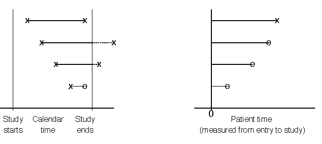
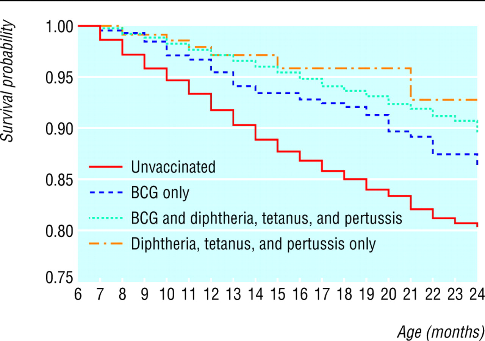

```{r child = "../setup.Rmd"}
```

```{r packages, echo=FALSE, message=FALSE, warning=FALSE}
library(tidyverse)
#githubinstall("emo")
library(emo)
```

## Getting Started!


In many studies, the outcome of interest is the time from an initial observation until the occurrence of some event of interest, e.g.

- Time from transplant surgery until new organ failure

- Time to death in a pancreatic cancer trial

- Time to first sex

- Time to natural menopause

- Time to divorce

- Time to receipt of bachelor's degree

Typically, the event of interest is called a *failure* (even if it is a good thing).   The time interval between a starting point and the failure is known as the *survival time* and is often represented by $t$.

---

## Survival Data

Certain aspects of survival data make data analysis particularly challenging. 

- Typically, not all the individuals are observed until their times of failure
    - A person may have medically-induced menopause (e.g., ovaries removed, damage due to chemo/radiation)
    - A student may withdraw from a degree program to start a multi-billion dollar company
    - Not everyone gets divorced
    - A pancreatic cancer patient may move to Aitutaki instead of undergoing further treatment
- In this case, an observation is said to be *censored* at the last point of contact with the patient.

---

## Survival


I hope you do visit Aitutaki some day! The Cook Islands are really nice.

---


## Study Time and Patient Time

{width=4in}


It is important to distinguish between study time and patient time.

- A study may start enrolling patients in September and continue until all 500 patients have been enrolled
- This is likely to take months or years
- Loan recipients have different starting dates for their loans
- Time is typically converted to person-level time (time between enrollment and failure or censoring) before analysis

---

## Notation

- $T$: Failure time, a non-negative random variable
- $C$: Censoring time, a non-negative random variable

Observed data for individual $i$:

- $Y_i$: $(T_i \wedge C_i)$, the minimum of $T_i$ and $C_i$
- $\delta_i$: $1_{(T_i \le C_i)}$, whether we observe a failure


If $\delta_i = 0$, we have **right censoring**

Commonly, we assume the censoring mechanism is *independent* of the failure mechanism.


**Our goal is to make inferential statements about** $T$.

---

## Survival Function

The distribution of survival times is characterized by the *survival function*, represented by $S(t)$.  For a continuous random variable $T$, $S(t)=Pr(T>t),$ and $S(t)$ represents the proportion of individuals who have not yet failed.  


The graph of $S(t)$ versus $t$ is called a survival curve.  The survival curve shows the proportion of survivors at any given time.

Note: sometimes the survival function is defined as $S(t)=Pr(T \geq t)$.

---


## Characterizing continuous $T$

- Density function: $f(t) = \lim_{\Delta t \to 0^+} \frac{P(t \le T < t + \Delta t)}{\Delta t}$

- Distribution function: $F(t) = P(T \le t) = \int_0^t f(s)ds$

- Survival function: $S(t) = P(T > t) = 1 - F(t)$

- Hazard function: $h(t) = \lim_{\Delta t \to 0^+} \frac{P(t \le T < t + \Delta t | T \ge t)}{\Delta t}$ 

- Cumulative hazard function: $H(t) = \int_0^t h(s)ds$

---

## Survival vs. hazard functions:

Survival (or survivor) function:

\begin{align*}
S(t) = P(T > t)
\end{align*}

- Non-increasing with $S(0) = 1$ and $\lim_{t \to \infty} S(t) = 0$
- For any given time $t$, a probability


Hazard function:

\begin{align*}
\lambda(t) = \lim_{\Delta t \to 0^+} \frac{P(t \le T < t + \Delta t | T \ge t)}{\Delta t}
\end{align*}

- Instantaneous failure rate, *given* already having survived to time $t$
- **Not** a probability (for continuous $T$)
- Non-negative and unbounded for all $t$
- Often more useful interpretations than survival functions


---

## Vaccination in Burkina Faso, 2004 *BMJ*

Survival of Children by Vaccination Status

```{r, echo=FALSE, out.width="50%"}

```

---

## Estimating the survival curve

The **Kaplan-Meier estimate** provides an intuitive *non-parametric* 
estimate of the survival curve:

- $D_i$: # who fail at time $t_i$
- $S_i$: # who have survived beyond $t_i$ (includes those who were censored
exactly at $t_i$)
- $N_i$: # at risk of failure at time $t_i$ (i.e., those who did not fail
before $t_i$ and were not censored before $t_i$)


The Kaplan-Meier estimate is

\begin{align*}
\hat{S}(t) = \prod_{i:t_i \le t}\left(1 - \frac{D_i}{N_i} \right) = \prod_{i: t_i \le t} \frac{S_i}{N_i}
\end{align*}

---

## Estimating the survival curve

\begin{align*}
\hat{S}(t) = \prod_{i:t_i \le t}\left(1 - \frac{D_i}{N_i} \right) = \prod_{i: t_i \le t} \frac{S_i}{N_i}
\end{align*}

How might we calculate P(survived past $t_1 \cap t_2$)?


P(survive past $t_1$)P(survive past $t_2$ | survived past $t_1$)

...and so on. If an observation is censored, it is no longer at risk of failing
at the next failure time and is taken out of the calculation.

---

## Estimating the survival curve

Suppose we had a small study with the following data:

| Patient | Event Time | Event Type | 
| ------- | ---------: | ---------- |
| 1       | 4.5        | Failure    |
| 2       | 7.5        | Failure    |
| 3       | 8.5        | Censoring  |
| 4       | 11.5       | Failure    |
| 5       | 13.5       | Censoring  |
| 6       | 15.5       | Failure    |
| 7       | 16.5       | Failure    |
| 8       | 17.5       | Censoring  |
| 9       | 19.5       | Failure    |
| 10     | 21.5       | Censoring  |

---

## Estimating the survival curve

| $t$  | Risk Set | # Failed | # Censored | $\hat{S}(t)$ |
| ---: | -------: | -------: | ---------: | :----------: |
| 0    | 10       | 0        | 0          | $1$          |
| 4.5  | 10       | 1        | 0          | $1 - \frac{1}{10} = 0.9$ |
| 7.5  | 9        | 1        | 0          | $0.9 \times (1 - \frac{1}{9}) = 0.8$ |
| 8.5  | 8        | 0        | 1          | $0.8 \times (1 - \frac{0}{8}) = 0.8$ |
| 11.5 | 7        | 1        | 0          | $0.8 \times (1 - \frac{1}{7}) = 0.69$ |
| 13.5 | 6        | 0        | 1          | $0.69 \times (1 - \frac{0}{6}) = 0.69$ |
| 15.5 | 5        | 1        | 0          | $0.69 \times (1 - \frac{1}{5}) = 0.552$ |
| 16.5 | 4        | 1        | 0          | $0.552 \times (1 - \frac{1}{4}) = 0.414$ |
| 17.5 | 3        | 0        | 1          | $0.414 \times (1 - \frac{0}{3}) = 0.414$ |
| 19.5 | 2        | 1        | 0          | $0.414 \times (1 - \frac{1}{2}) = 0.207$ |
| 21.5 | 1        | 0        | 1          | $0.207 \times (1 - \frac{0}{1}) = 0.207$ |

---

## Estimating the survival curve

```{r, echo = F, warning=FALSE, message=FALSE}
library(tidyverse)
library(survival)
dat <- tibble(times = c(4.5, 7.5, 8.5, 11.5, 13.5, 15.5, 16.5, 17.5, 19.5, 21.5),
              event = c(1, 1, 0, 1, 0, 1, 1, 0, 1, 0))
```
```{r}
dat
```


---

## Estimating the survival curve

```{r, message = F, warning = F, fig.height = 5}
plot(survfit(Surv(times, event) ~ 1, data = dat), 
     xlab = "Days", ylab = "Est. Survival Probability",
     conf.int = F)
```


---

## Estimating the survival curve

```{r, message = F, warning = F, fig.height = 3.5}
library(survminer)
ggsurvplot(survfit(Surv(times, event) ~ 1, data = dat), 
     xlab = "Days", ylab = "Est. Survival Probability",
     conf.int = F)
```

Check out the `ggsurvplot` function [here](https://www.rdocumentation.org/packages/survminer/versions/0.4.8/topics/ggsurvplot).


---

## Kaplan-Meier Estimate

In between failure times, the KM estimate does not change but is constant.  This gives the estimated survival function its step-like appearance (we call this type of function a *step function*). If we have a very large data set, the KM estimate may look smooth if the steps are very small.


---

## Parametric Survival Models: Exponential and Weibull

The shape and characteristics of the hazard and survival functions depend on the assumed probability distribution for the survival times.

Recall the exponential distribution, $f(t)=\lambda e^{-\lambda t}$, for $\lambda, t>0$, which has mean $\frac{1}{\lambda}$ and variance $\frac{1}{\lambda^2}$. The exponential survivor function $S(t)=Pr(T>t)=\int_t^\infty \lambda e^{-\lambda t} dt=\frac{-\lambda e^{-\lambda t}}{\lambda}|_t^\infty=e^{-\lambda t}$, and so the exponential hazard $h(t)$ (to avoid confusing notation here) is given by $h(t)=\frac{f(t)}{S(t)}=\lambda \frac{e^{-\lambda t}}{e^{-\lambda t}}=\lambda$.   The parameter $\lambda$ is often called a scale parameter.

---

## Exponential Distribution

So under the exponential model, the hazard of the event of interest does not change with time.  Let's generate some data and look at the exponential pdf.

```{r exp, echo=FALSE, out.width='70%'}
# thanks to dkmathstats
library(ggplot2)
x_lower=0; x_upper=10; 
max_height2 <- max(dexp(x_lower:x_upper, rate = 1, log = FALSE), 
                    dexp(x_lower:x_upper, rate = 0.1, log = FALSE),
                    dexp(x_lower:x_upper, rate = 0.01, log = FALSE))
ggplot(data.frame(x = c(x_lower, x_upper)), aes(x = x)) + xlim(x_lower, x_upper) + 
     ylim(0, max_height2) +
     stat_function(fun = dexp, args = list(rate = 1), aes(colour = "1")) + 
     stat_function(fun = dexp, args = list(rate = 0.1), aes(colour = "0.1")) + 
     stat_function(fun = dexp, args = list(rate = 0.01), aes(colour = "0.01")) + 
     scale_color_manual("lambda", values = c("blue", "green", "red")) +
     labs(x = "\n x", y = "f(x) \n", 
        title = "Exponential Distribution Density Plots \n") + 
     theme(plot.title = element_text(hjust = 0.5), 
         axis.title.x = element_text(face="bold", colour="blue", size = 12),
         axis.title.y = element_text(face="bold", colour="blue", size = 12),
         legend.title = element_text(face="bold", size = 10),
         legend.position = "right")

```

---

## Exponential Hazard

Here's the exponential hazard for the same values of $\lambda$.

```{r exphaz, echo=FALSE,out.width='70%'}
ggplot(data.frame(x = c(x_lower, x_upper)), aes(x = x)) + xlim(x_lower, x_upper) + 
     ylim(0, max_height2) +
     geom_hline(aes(yintercept=1, linetype="1"),colour="red") +
     geom_hline(aes(yintercept=0.1,linetype="0.1"),colour="green") +
     geom_hline(aes(yintercept=0.01,linetype="0.01"),colour="blue") +
     labs(x = "\n x", y = "h(x) \n", 
        title = "Exponential Distribution Hazard Plots \n") + 
     theme(plot.title = element_text(hjust = 0.5), 
         axis.title.x = element_text(face="bold", colour="blue", size = 12),
         axis.title.y = element_text(face="bold", colour="blue", size = 12),
         legend.title = element_text(face="bold", size = 10)) +
     scale_linetype_manual(name="lambda",values=c(1,1,1),guide=guide_legend(override.aes=list(colour=c("blue","green","red"))))
```

---

## Weibull Distribution

The Weibull distribution is a generalization of the exponential distribution that allows greater flexibility in the distribution of survival times via inclusion of the shape parameter $\alpha$.

The Weibull can be written $f(t)=\alpha \lambda t^{\alpha-1} e^{-\lambda t^\alpha}$, for $\lambda, \alpha, t>0$, which reduces to the exponential distribution when $\alpha=1$. Its survivor function is $S(t)=e^{-\lambda t^\alpha}$ and hazard function is $\alpha \lambda t^{\alpha-1}$.

---

## Weibull Distribution

```{r weib, echo=FALSE,out.width="70%"}
x_lower_wei <- 0
x_upper_wei <- 3

ggplot(data.frame(x = c(x_lower_wei , x_upper_wei)), aes(x = x)) + 
  xlim(c(x_lower_wei , x_upper_wei)) + 
  stat_function(fun = dweibull, args = list(shape = 2, scale = 1), aes(colour = "2 & 1")) + 
  stat_function(fun = dweibull, args = list(shape = 3, scale = 1), aes(colour = "3 & 1")) + 
  stat_function(fun = dweibull, args = list(shape = 0.5, scale = 1), aes(colour = "0.5 & 1")) + 
  scale_color_manual("alpha & lambda", values = c("blue", "green", "red")) +
  labs(x = "\n x", y = "f(x) \n", 
       title = "Weibull Distribution Plots") + 
  theme(plot.title = element_text(hjust = 0.5), 
        axis.title.x = element_text(face="bold", colour="blue", size = 12),
        axis.title.y = element_text(face="bold", colour="blue", size = 12),
        legend.title = element_text(face="bold", size = 10),
        legend.position = "right")

```

---

## Weibull Hazards

```{r weibhaz, echo=FALSE,out.width="60%"}
x=seq(0.01,2,by=0.001)
weibhaz=data.frame(x=c(x,x,x),haz=c(2*x,3*x^2,1/(2*sqrt(x))),alpha=c(rep("2",length(x)),rep("3",length(x)),rep("0.5",length(x))))
ggplot(weibhaz,aes(x=x,y=haz))+
  geom_line(aes(color=alpha,linetype=alpha)) +
  scale_color_manual(values=c("blue","green","red"))
```

For the Weibull distribution, the hazard is increasing for $\alpha>1$, decreasing for $0<\alpha<1$, and constant (exponential) for $\alpha=1$. What type of hazard makes sense for studying lifespans?

---

## Other Hazards

In some applications, monotone hazard functions may not be realistic. In reliability engineering, you often have a bathtub-shaped hazard, with a decreasing rate of early failures, a constant failure rate during the main lifetime of the product, and an increasing failure rate as the product begins to wear out.

Perhaps the most popular survival model in public health and medicine is the Cox (1972) proportional hazards model, which is a semi-parametric model that makes no assumption about the shape of the baseline hazard function.

---

## Adding Covariates

We are often interested in assessing the relationship between covariates or predictors of interest and survival. For example, do patients with a certain gene receptor have better responses to treatment?

The most popular class of models used in survival analysis is the class of *proportional hazards* models.

---

## Proportional Hazards Models

Under a proportional hazards model, the hazard of death at time $t$ for individual $i$ is given by $h_i(t)=h_0(t)e^{\beta_1 x_{i1}+\beta_2 x_{i2} + \cdots + \beta_px_{ip}}$.  We call $h_0(t)$ the baseline hazard. In a Weibull model, we assume that $h_0(t)=\lambda \alpha t^{\alpha-1}$, and in an exponential model, we assume $h_0(t)=\lambda$.

Consider a simple model with one binary covariate $x$ that takes value 1 for one group and 0 for the other. Then the hazard at time $t$ for those in group 1 is $h_0(t)e^\beta$, and the hazard at time $t$ for those in group 0 is $h_0(t)$. Because the hazard in group 1 is proportional to the hazard in group 0, this type of model is called a *proportional hazards* model. 

$e^\beta$ is called the hazard ratio. When $\beta>0$, the hazard ratio$>1$, and we expect those in group 1 to fail more quickly. When $\beta<0$, the hazard ratio$<1$, and we expect those in group 1 to be protected against failure.

---

## Accelerated Failure Time Models

Another large class of survival models is that of *accelerated failure time (AFT)* models. The Weibull model can be interpreted both as a proportional hazards model and as an AFT model. There are some nice features of interpretation of parameter estimates in the Weibull AFT model (e.g., you can interpret a function of the parameters as the percentage increase in survival time for a unit increase in a predictor).


