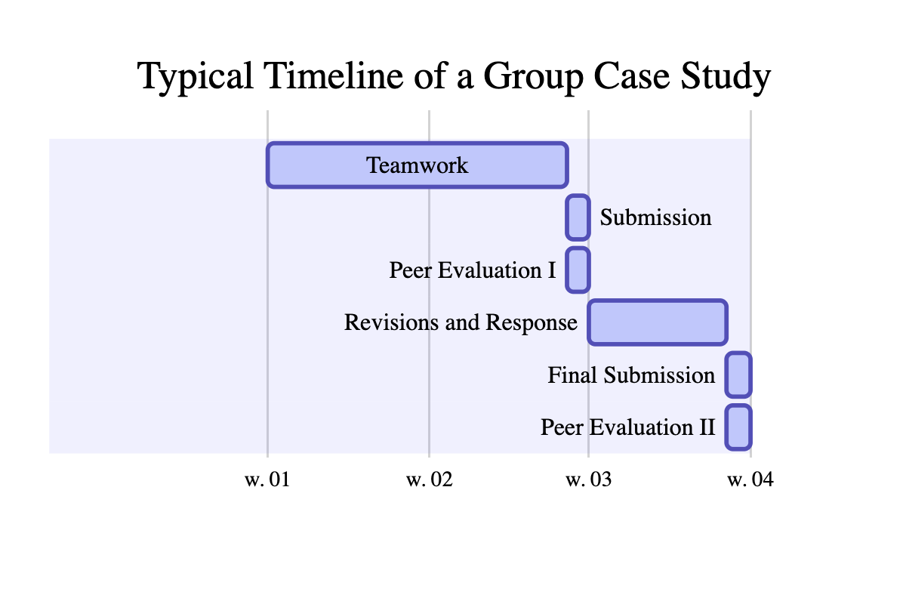

```{r, echo=FALSE, include=FALSE}
library(kableExtra)
library(knitr)
library(tidyverse)
library(DiagrammeR)
```


### Health & wellness

If you find that anything is affecting your well-being or academic success and you find it difficult to complete your work, please let me and your Academic Dean know as soon as possible. We are happy to work with you to make sure you succeed in STA 440. You may also find additional information regarding personal emergencies [here](https://trinity.duke.edu/undergraduate/academic-policies/personal-emergencies).


### Diversity, inclusiveness, and accessibility

The Duke University Community Commitment states: "Because diversity is essential to fulfilling the university’s mission, Duke is committed to building an inclusive and diverse university community.  Every student, faculty, and staff member —whatever their race, gender, age, ethnicity, cultural heritage or nationality; religious or political beliefs; sexual orientation or gender identity; or socioeconomic, veteran or ability status—has the right to inclusion, respect, agency and voice in the Duke community.  Further, all members of the University community have a responsibility to uphold these values and actively foster full participation in university life."

It is my goal for our learning environment to facilitate learning and intellectual development for everyone. To help accomplish this:
  
  - If you have a name and/or set of pronouns that differ from those that appear in your official Duke records, please let me know.
  - We are constantly learning more about diverse perspectives and identities. If something occurred in class that made you feel uncomfortable, please talk to me about it. 
  - Duke University is committed to providing equal access to students with documented disabilities. Students with disabilities may contact the [Student Disability Access Office](https://access.duke.edu/students) to ensure access to this course and to the program. There you can engage in a confidential conversation about the process for requesting reasonable accommodations both in the classroom and in clinical settings. 
  

### Academic integrity

Duke University is a community dedicated to scholarship, leadership, and service and to the principles of honesty, fairness, respect, and accountability. Citizens of this community commit to reflect upon and uphold these principles in all academic and nonacademic endeavors, and to protect and promote a culture of integrity.

Remember the Duke Community Standard that you have agreed to abide by:
  
To uphold the Duke Community Standard:
  
- I will not lie, cheat, or steal in my academic endeavors;
- I will conduct myself honorably in all my endeavors; and
- I will act if the Standard is compromised.

Cheating or plagiarism on assignments, lying about an illness or absence and other forms of academic dishonesty are a breach of trust with classmates and faculty, violate the [Duke Community Standard](https://trinity.duke.edu/undergraduate/academic-policies/community-standard-student-conduct), and will not be tolerated. Such incidences will result in a 0 grade.  Additionally, there may be penalties to your final class grade along with being reported to the Conduct Board.

Please review the [Duke Community Standard in Practice](https://registrar.duke.edu/university-bulletins/duke-community-standard). 

- Occasionally datasets we are privileged to use in class are confidential and cannot be distributed more broadly. Further dissemination of such datasets, made available on Sakai, will be considered a violation of the Duke Community Standard. If you are unsure whether you can use a dataset for purposes beyond class, please ask me.

- Much of the work assigned in class is collaborative. The individual case study must be completed independently. Group case studies are to be completed by groups and must represent the group's own work. For other assignments, while you may talk about strategies for completing them with other students in the class, the work you submit must be your own individual work.

- Important note: do not share your course materials with other students after completion of this course. Doing so will be considered a violation of the Duke Community Standard.

**Referencing code:** The web contains an enormous volume of code that you may find useful. You are welcome to make use of any online resources (e.g. StackOverflow), but you must explicitly cite your sources (for code and otherwise). Any recycled or auto-generated code that is discovered and is not explicitly cited will be treated as plagiarism. On the individual case study you may not directly share code with another student in this class, and on team assignments you may not directly share code with another team in this class (you are welcome to discuss the problems together and ask for advice, or make suggestions in peer review, but you may not send or copy code from another team). 

### Course components

#### Class sessions

Attendance is expected of all students. Students with conflicts or illness are expected to contact the instructional team and project team members in order to make up any missed work.

#### Teams

Each group case study will be completed by a team of around 4 students. Groups will change throughout the semester to allow you the opportunity to work with more students. Groups should adhere to specified [group policies](grouppolicies.html).

#### Group case studies

STA 440 involves detailed analysis of case studies using current, relevant data. Each case study will involve two submissions by the group, as well as a peer review of another group's submission. Case study submissions will involve an initial written report. This first submission will receive a grade of $x$. After receipt of comments from the instructor and classmates, groups will have the opportunity, but are not required, to submit a revised report for which they can earn up to an additional 0.5(100-x) points.

Individual contributions to each submission will be assessed. Team members must provide these assessments in order to receive credit for an assignment as part of the group's peer evaluation process. *An individual team member's grade will be modified if peer evaluations indicate this is appropriate; modification can result in a grade as low as 0.*

Each case study will have a page limit, and under no circumstances should font sizes less than 11 point be used, with the exception of labels in figures (and then only if they are still clearly legible to readers of all ages).

#### Peer review

Students will be asked to provide feedback and comments on the case studies presented by other groups throughout the course. This feedback will be provided to the groups and will also be assessed as part of the course. The ability to provide thoughtful, constructive feedback is critical in the workplace and a valued skill. Peer reviewers will be asked to check reproducibility. Reviewers of a case will have the opportunity to discuss the case with other reviewers, but each individual's reviews will be assessed individually.

{width=10in} 

```{r flowgroup, echo=FALSE, eval=FALSE}
mermaid("
gantt
        dateFormat  YYYY-MM-DD
        title Typical Timeline of a Group Case Study
        Teamwork :active,    des1, 2014-01-06, 13d
        Submission               :active,  des2, after des1, 1d
        Peer Evaluation I              :active,  des2, after des1, 1d
        Revisions and Response        : active,  des3, after des2, 6d
        Final Submission   :   active, des4, after des3, 1d
        Peer Evaluation II   :   active, des4, after des3, 1d 
")

```

#### Individual project

Each student will complete an individual project as part of the course. The individual project should use data that have not previously been used by the student in a project, and the analysis should be entirely the student's own work. Any external resources used should be clearly documented. The student may use self-identified data or a resource provided by the instructor. 

The individual project involves multiple due dates throughout the semester, to ensure students devote the required time and energy to their effort. These interim submissions will be reviewed by the instructional team and at times by peers, with the goal of maximizing the quality of the final report.


#### Lab and class activities

A number of smaller scale assessments will be administered, with the goal of honing skills in a variety of areas, including scientific communication, model evaluation, use and conduct of simulation studies, research ethics, and interpretation of results. Additional topics will be added based on the course trajectory and student needs. These activities will provide a way to obtain individual feedback on important statistical science skills.


### Grading

Your final grade will be comprised of the following.

|Component | % of Grade |
| ----------    | -----------------:|     
|Individual Assignments (including peer reviews)     | 10% |
|Group case study 1       | 15% |
|Group case study 2   | 20%   |
|Group case study 3          | 20% |
|Individual project submission I      | 5% |
|Individual project submission II      | 15% |
|Individual project final report (part III) and oral presentation    | 15% |

Each report will be graded based on the initial submission, with the ability to earn additional points based on the revised report for the individual project and case studies. 

Cumulative numerical averages of 90 - 100 are guaranteed at least an A-, 80 - 89 at least a B-, 70 - 79 at least a C-, and 60 - 69 at least a D-; however, the exact ranges for letter grades will be determined at the end of the semester. The grade ranges may need to be shifted to the left, and when appropriate, students will be given guidance on interpreting grades when assignments are returned. The more evidence there is that the class is performing at the highest level, the higher the grade distribution will be. 


### Late / missed work

If work is turned in within 24 hours after the due date/time, then there is a 20% penalty. However, due to the fast-paced nature of this course, absolutely no late work will be accepted beyond this period without a Dean's excuse. 


### Regrade requests

Regrade requests must be made within two days of when a report is returned. These will be honored if points were tallied incorrectly, or if you feel part of your report is correct, but it was marked wrong (these things do happen!). No regrade will be made to alter the number of points deducted for an issue. When a regrade request is evaluated, if new errors are identified, additional points may be deducted from the grade. 


